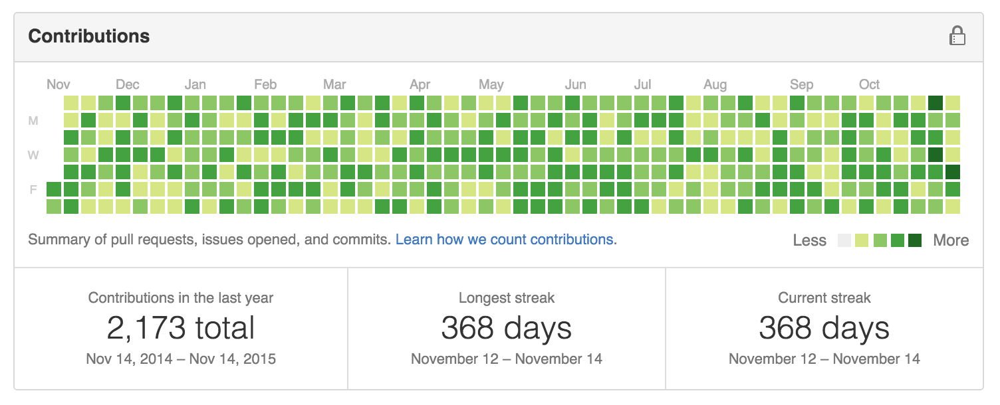

# greenhat

`greenhat` 是一个通过在过去的 n 天内提交一些信息来快速的装饰你的 GitHub contribution calendar 的一个小工具。想法源自 [https://github.com/4148/greenhat](https://github.com/4148/greenhat), 为了使用方便，用 `Node` 实现了一下，并加入了系统环境变量之中。它使用了 `GIT_AUTHOR_DATE` 和 `GIT_COMMITTER_DATE` 这两个环境变量来创造出在过去的提交记录。需要警告的是，`greenhat` 会破坏掉你的仓库的提交记录。

#### 安装

确保在安装之前你已经安装好了 `node` `npm` 环境。

##### 全局安装
```
$ npm install -g greenha
```

##### 本地安装
* 在目标目录执行 `npm install greenhat` 命令
* clone 本仓库代码到本地，然后将 `bin/greenhat.js` 文件拷贝至目标目录

#### 使用

确保你的远程仓库地址已经设置过，并且也设置过 SSH 部署公钥。在目标仓库中，你可以通过指定一个整数 n 来表示从 n 天前开始创造提交记录，例如:

```
$ greenhat <n> 
```

or:

```
$ greenhat -d <n> 
```

PS: 如果你是使用本地安装的方式，那么你需要在目标文件夹中使用下面的方式执行程序(确保`bin/greenhat.js` 文件的位置)，然后按照以下方式执行:

```
$ node bin/greenhat.js <option> 
```

如果你设置的时间太长，那通常需要花费一段时间才能完成所有的提交。如果 `greenhat` 在完成任务前终止了，你也可以通过指定一个特定格式的日期来从某天开始继续进行提交。就像是这样:

```
$ greenhat -d <n> -D <date> 
```

`n` 表示你想创造提交记录的天数。 `date` 是一个 `yyyy-mm-dd` 格式的字符串。(e.g. 2015-11-13)

如果你使用了 `-l, --log` 参数，程序将会在终端中打印出所有的执行日志。

#### 例子

下面这张图片是执行完 `greenhat 365` 命令得到的结果，So beautiful, isn't it?



Now, just enjoy it.